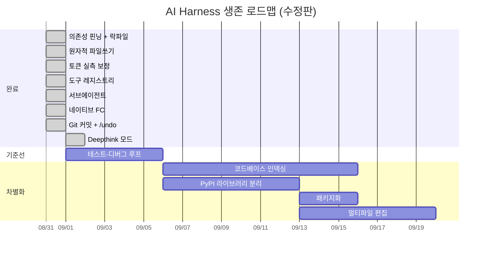

# 🗺️ AI Harness 생존 로드맵

> **원칙**: 1-2인 개발로 전부 할 수는 없다. **가장 적은 노력으로 가장 큰 생존 임팩트**를 주는 순서로.

이 문서는 외부 리뷰로 받은 초안을 **실제 코드와 실제 설치 환경에 대조해 수정한 판본**이다.
초안이 틀렸던 부분은 [§0](#0-초안에서-수정한-것)에 남겨 두었다 — 같은 실수를 반복하지 않기 위해서다.

---

## 0. 초안에서 수정한 것

초안을 쓴 모델은 `C:/Users/user/AppData/Local/Temp/chat/`에 풀린 사본을 읽었다.
코드는 봤지만 **설치된 패키지 버전은 못 봤다**. 그래서 다음이 틀렸다.

| 초안의 제안 | 실제 | 왜 틀렸나 |
|:---|:---|:---|
| `duckduckgo_search>=6.0,<7.0` | 설치본 **8.1.1** | 핀을 따르면 **다운그레이드**된다 |
| `tree-sitter>=0.22,<0.24` | 설치본 **0.26.0** | 같음 |
| `psutil>=5.9,<7.0` | 설치본 **7.2.2** | 같음 |
| tiktoken(`cl100k_base`)으로 토큰 계산 | — | cl100k는 gemma·Claude·Gemini 어느 것의 토크나이저도 아니다. 무거운 의존성을 추가하고 **다른 종류의 오차**를 얻는다 |
| 서브에이전트 = 2-3주, Phase 3 | 실제 1일 | `chat_turn`을 재사용하면 대부분이 이미 있다. 초안의 예제 코드는 실행되지 않는다(`chat_turn`에 `model` 인자가 없고, 반환값은 `str`이라 `.complete`가 없다) |
| 파일 링크가 전부 `C:/.../Temp/chat/` | — | 저장소 상대경로여야 한다 |

> [!IMPORTANT]
> **교훈**: 의존성 핀은 추측하면 안 된다. 돌아가는 환경에서 읽어야 한다.
> 지금 `requirements.txt`의 하한은 전부 **실제로 테스트를 통과한 버전**이다.

초안이 **맞았던 것**: 핀닝 부재, 비원자적 파일 쓰기, `_CHARS_PER_TOKEN = 3.5`의 부정확성,
if/elif 디스패치 체인과 하드코딩 JSON 스키마의 이중화, 네이티브 FC 부재. 전부 실재하는 문제였다.

---

## 1. 완료 (이번 작업)

### ✅ 0-1. 의존성 핀닝
`requirements.txt`의 하한 = 테스트를 통과한 설치 버전, 상한 = 다음 메이저(0.x는 다음 마이너).
`requirements-lock.txt`로 정확한 재현 세트를 함께 제공한다.

### ✅ 0-2. 원자적 파일 쓰기 — `atomic.py`
`tempfile.mkstemp` → `fsync` → `os.replace`. 적용 대상은 초안이 지목한 세 곳에
**`providers.py:save_state`를 더한 네 곳**이다. 이게 제일 중요했다 — API 키가 들어 있다.

덤으로 보안 구멍 하나가 닫혔다. 기존 코드는 `open()`으로 만들고 **그 다음** `chmod 0600`을 했다.
그 사이 순간에 키 파일은 누구나 읽을 수 있었다. `mkstemp`는 처음부터 0600으로 만든다.

검증: 쓰기 도중 프로세스를 죽여도 읽는 쪽은 **항상 이전 파일 전체**를 본다 (`tests/test_durability.py`).

### ✅ 0-3. 토큰 계산 — tiktoken 대신 **프로바이더 실측 보정**
tiktoken을 쓰지 않았다. 대신 **이미 매 턴 받고 있던 `prompt_tokens`** 를 되먹인다.
의존성 0, 모델별로 정확하고, 스스로 수렴한다.

정적 추정은 문자 종류를 나눈다(한글·한자·가나 2.0자/토큰, 그 외 4.0자/토큰).
실행 중인 모델로 측정한 결과:

| 대화 | 실제 | 기존 3.5 고정 | 개선 후(정적) | 1턴 보정 후 |
|:---|---:|---:|---:|---:|
| 한국어 | 435 | 233 (**−46%**) | 351 (−19%) | 435 (**0%**) |
| 한국어+코드 | 703 | 466 (−34%) | 555 (−21%) | 708 (+0.7%) |
| 영어 | 216 | 299 (+38%) | 262 (+21%) | 215 (−0.5%) |

**과소 계산이 위험한 방향이다** — 컨텍스트가 조용히 넘친다. 한국어 −46%가 실제 위험이었다.

### ✅ 1-2. 도구 레지스트리 — `toolspec.py`
도구 목록이 **두 벌** 있었다: 시스템 프롬프트 안의 손으로 쓴 JSON 배열, 그리고
인자를 다시 꺼내는 28갈래 `if function_name == ...` 체인. 둘을 묶는 것이 없었다.

이제 한 테이블에서 프롬프트를 **렌더링**하고 디스패치가 인자를 **바인딩**한다.
교체가 안전한지는 생성된 배열이 기존 손글씨 배열과 **완전히 동일함**을 확인해서 증명했다.

초안의 데코레이터 대신 **불일치 시 기동 거부**를 택했다. 테스트보다 강하다 — 프로그램이 뜨지 않는다:

```
tool registry is inconsistent - described to the model but not implemented: edit_file
```

`systemprompt.py`가 304줄 → 113줄이 됐다. 부수 효과로 `toolspec.native_schema()`가
같은 테이블에서 나오므로, 네이티브 FC(1-1)는 이제 **스키마 작성이 아니라 배선 작업**이다.

### ✅ 1-1. 네이티브 Function Calling
초안이 "가장 큰 설계 부채"로 꼽은 항목. 레지스트리 위에서 배선만 하면 됐다.

| | 도구 전달 | 호출 수신 |
|:---|:---|:---|
| **Ollama** | 시스템 프롬프트에 나열 | `<tool_call>` 텍스트 + JSON 복구 |
| **Anthropic·OpenAI·Gemini** | 요청에 함께 전송 | API 자체 tool-call 이벤트 |

**로컬 텍스트 경로는 한 글자도 건드리지 않았다.** 4B 모델은 제대로 된 function call을
못 만든다 — JSON 복구 엔진이 존재하는 이유가 그것이다.

프롬프트가 **17.8KB → 5.8KB** 로 줄었다(매 턴). 도구 목록을 프롬프트에 적을 필요가 없어졌다.

배선의 핵심은 **양쪽이 같은 것으로 수렴한다**는 점이다:
- 스키마는 `toolspec.native_schema()` 하나에서 나온다 → 두 프로토콜이 어긋날 수 없다
- 호출은 둘 다 `(name, arguments)` 쌍이 된다 → 디스패치·권한·표시·세션 파일이 차이를 모른다
- **히스토리는 어느 쪽이든 평문이다** → Anthropic으로 저장한 세션이 Ollama에서 그대로 재생된다

네이티브 모드에서는 raw 블록이 없으므로 `content` 같은 블록 파라미터가 진짜 필수 파라미터가 된다.
`write_file`처럼 설명문이 프로토콜마다 달라야 하는 6곳은 `native_description`으로 분리했다.
MCP 도구도 함께 네이티브로 보낸다 — 안 그러면 네이티브 전환 시 모델이 MCP 도구를 통째로 잃는다.

프로바이더가 보낸 인자 JSON이 깨졌을 때는 **도구를 실행하지 않고** 모델에게 되돌린다.
JSON이 깨졌다고 `delete_file`을 빈 인자로 부르는 건 복구 가능한 실수가 아니다.

`config.NATIVE_TOOLS = False`로 전부 텍스트 프로토콜로 되돌릴 수 있다 —
tool 지원이 없는 OpenAI 호환 서버용이다.

### ✅ 1-3. Git 자동 커밋 + `/undo` — `git_ops.py`
AI가 파일을 바꿀 때마다 **그 파일만** 따로 커밋한다. 메시지가 어느 도구였는지 말한다:

```
ai(edit_file): greet.py
```

`/undo`가 맨 위 커밋을 되돌리고, `/autocommit on|off`로 끌 수 있다.

편집하는 어시스턴트는 **undo만큼만 쓸모 있다.** undo가 없으면 정직한 조언은
"건드리게 하기 전에 커밋해라"인데 아무도 안 지키고, 세 번 전의 잘못된 편집은 사라진다.

성가시지 않게 하는 규칙 두 개:

**도구가 지목한 파일만 커밋한다.** 사용자가 stage해 둔 것, 고쳐 둔 것은 그대로 둔다 —
`git commit`에 경로를 명시적으로 넘겨서 인덱스를 쓸어담지 못하게 한다.

**undo는 자기가 안 만든 것을 부수느니 거부한다.** 사용자가 쓴 커밋은 건드리지 않고,
커밋 안의 파일이 그 뒤 바뀌었으면 멈추고 어느 파일인지 말한다.

git이 없는 머신, 저장소 밖에서도 아무 일도 안 일어나고 아무것도 안 깨진다.

**테스트가 잡은 버그 2건**: 삭제된 파일 경로를 디렉터리로 취급해 `delete_file`이 죽던 것,
그리고 `git status --porcelain`을 `.strip()`해서 경로 첫 글자가 잘리던 것.

### ✅ 로드맵에 없던 발견: Ollama도 네이티브 도구를 쓴다
초안도 나도 "로컬은 텍스트, 클라우드는 네이티브"로 가정했는데 **틀렸다.**
`ollama.show()`가 모델별 `capabilities`를 보고하고, 설치된 20개 중 15개에 `tools`가 있다.

그래서 프로바이더 단위가 아니라 **모델 단위로** 판단한다. gemma4:e4b는 네이티브로 가고
프롬프트가 17.8KB → 5.1KB가 됐다. gemma3:4b는 tools가 없어 텍스트 경로로 간다.

폴백이 핵심이다. 템플릿이 tool call을 못 만드는 모델은 **애초에 호출을 안 한다** —
그런 모델을 쓸 수 있게 만드는 게 텍스트 프로토콜과 JSON 복구 엔진이다.
데몬이 죽었거나 물어볼 수 없는 모델도 텍스트로 간다. 어디서나 되는 쪽이 안전한 기본값이다.

### ✅ 로드맵에 없던 것: Deepthink 모드
한 요청을 다섯 턴으로 쪼갠다. `/deepthink on`으로 켠다.

```
1 계획   무엇이 필요한지 — 파일을 읽고, 아무것도 바꾸지 않는다
2 검사   그 계획을 공격한다. 가정을 전부 확인한다
3 구현   확정된 계획을 수행한다
4 변경검사 실제 diff를 읽고 잘못된 것을 고친다
5 최종검사 돌려본다. 진짜로 나온 결과를 보고한다
```

다섯 단계가 **한 대화**다. 바뀌는 건 매 턴 맨 위에 붙는 지시뿐이다.

**두 단계가 이 모드의 값어치를 진다.** 2단계는 계획이 틀렸음을 증명하는 게 유일한 임무다 —
아무도 반박하지 않은 계획이 대개 실패하는 계획이다. 4단계는 "뭘 바꿨냐"고 묻지 않고
**실제 `git diff`를 손에 쥐여준다.** 기억으로 하는 리뷰는 아무것도 못 찾는다.
기억하는 건 코드가 아니라 의도이기 때문이다.

**앞 두 단계는 편집을 못 한다.** "하지 말라고 요청"이 아니라 도구가 꺼진다.
라이브 테스트에서 로컬 4B 모델이 계획 단계에 **`edit_file`을 15번** 시도했다.
요청만으로는 안 지켜지고, 안 지켜지면 나머지 단계가 계획된 적 없는 것을 검토하게 된다.

**만들 게 없으면 일찍 멈춘다.** 질문은 다섯 턴이 아니라 한 턴이다.
모델이 마커를 잊으면 계획문을 짧은 호출로 되읽어 판단한다. 애매하면 "할 일 있음"으로 친다.

**부수적으로 고친 일반 문제**: 거절당한 도구를 계속 두드리는 모델을 3회에 끊는다.
deepthink뿐 아니라 `deny` 권한 규칙, 서브에이전트 금지 도구, 사용자가 거절한 승인에서도
똑같이 벌어지던 일이다.

### ✅ 3-2. 서브에이전트 — `subagent.py` (앞당김)
Phase 3에 있었지만 레지스트리 위에서는 하루짜리였다. `spawn_agent` 도구:

- 자기 시스템 프롬프트·자기 히스토리·자기 도구 루프를 가진 새 대화;
- **보고서만** 돌아온다. 검색 도중의 도구 결과 스무 개는 서브에이전트 컨텍스트에서 죽는다;
- 프로토콜 규칙은 `systemprompt.tool_rules()`로 **공유**한다 — 복사하면 일주일 안에 어긋난다;
- 도구 호출은 같은 `dispatch_tool`을 지나므로 **권한 규칙을 우회하지 못한다**;
- `get_user_input`·`submit_plan_for_approval`·`spawn_agent`는 주지 않는다(3중 방어: 목록 제외, 호출 시 거부, 깊이 검사);
- 턴 예산 12회, 소진 시 잘라내지 않고 **가진 것으로 보고서를 쓰게** 한다;
- 다른 모델 지정 가능 — 긴 기계적 검색은 싼 모델에.

### ✅ 로드맵에 없던 버그 2건

**`NUM_PREDICT`가 float이었다.** `4096*1.5` = `6144.0` → `{"max_tokens": 6144.0}`.
Anthropic·OpenAI·Gemini는 정수만 받는다. **`/connect anthropic` 후 첫 메시지에서 400이 났을 것이다.**
Phase 1 전체가 이 위에 서 있었다.

**프롬프트가 자기모순이었다.** DO 규칙 3은 "이스케이프하지 말고 raw 블록을 써라",
IMPORTANT 규칙 17은 "파일 내용은 JSON으로 이스케이프하라". 규칙 17은 raw 블록 도입 전의 잔재고,
7/7 세션 실패를 일으켰던 바로 그 지시였다.

---

## 2. 다음 — 우선순위 순

### 2-1. 🎯 자동 테스트-디버그 루프
**임팩트: ★★★★★ | 난이도: ★★½ | 소요: 3-5일**

편집 후 프로젝트 유형을 감지해 린트/테스트를 돌리고, 실패하면 에러를 tool result로 되먹인다(최대 3회).
2-1이 먼저다 — 자동 수정이 잘못 갔을 때 되돌릴 수단이 없으면 위험하다.

### 2-2. 🚀 코드베이스 시맨틱 인덱싱
**임팩트: ★★★★★ | 난이도: ★★★★ | 소요: 1-2주**

Tree-sitter 파서 10종은 이미 있다. `get_code_skeleton`을 프로젝트 전체로 확장 → 심볼 테이블 캐싱.
**서브에이전트와 잘 맞는다**: 인덱스 구축이라는 무거운 작업을 자기 컨텍스트에서 하고 요약만 넘긴다.

### 2-3. 🚀 핵심 기술 PyPI 분리
**임팩트: ★★★★ | 난이도: ★★½ | 소요: 1주**

CLI가 경쟁에서 밀려도 **라이브러리가 살아남는 보험**. 이 프로젝트에서 가장 독창적인 조각들이다.

| 분리 대상 | 패키지명(제안) | 왜 남의 프로젝트가 쓰나 |
|:---|:---|:---|
| JSON 복구 엔진 | `llm-json-repair` | 로컬 LLM은 전부 이 문제를 겪는다 |
| Zero-SDK MCP 클라이언트 | `mcp-client-lite` | 의존성 없이 MCP를 붙이고 싶은 모든 곳 |
| 인터랙티브 셸 | `smart-shell-session` | 입력 대기 감지는 재발명하기 귀찮다 |
| 해시라인 편집 | `hashline-edit` | LLM 파일 편집 도구 |

### 2-4. 📦 `pip install` + 엔트리포인트
**임팩트: ★★★★ | 난이도: ★★ | 소요: 2-3일**

`python app.py` → `harness`. 설치 장벽이 곧 사용자 수다.

### 2-5. 🚀 멀티파일 원자적 편집
**임팩트: ★★★★ | 난이도: ★★★ | 소요: 1주**

git 커밋이 롤백 수단을 제공하므로 그 위에 얹는 것이 맞다.

---

## 3. 실행 순서



---

## 4. 핵심 메시지

> [!CAUTION]
> Phase 0, 네이티브 FC, Git 커밋까지 끝났다. **테스트-디버그 루프와 PyPI 분리를 한 달 안에 못 끝내면 나머지는 의미가 없다.**
> Aider/Goose/Cline이 같은 기능을 더 빠르게 추가하고 있다.

**남은 것 중 가장 중요한 3가지:**
1. **테스트-디버그 루프** — 2026년 테이블 스테이크스. `/undo`가 있으니 안전망은 이미 깔렸다
2. **PyPI 라이브러리 분리** — CLI가 죽어도 기술 자산이 살아남는 보험
3. **코드베이스 인덱싱** — 서브에이전트와 맞물리는 유일한 큰 차별화 요소

### 정직한 평가

생존 가능성이 낮다는 판단 자체는 옳다. 하지만 이유가 기능 개수는 아니다.
Aider와 기능으로 경쟁하는 것은 1-2인으로 이길 수 없는 싸움이다.

이길 수 있는 싸움은 **아무도 제대로 안 한 것**이다:

- **로컬 모델을 실제로 작동시키는 것.** JSON 복구 엔진과 raw 블록은 진짜 발견이었다
  — 파일 전체를 JSON 문자열로 이스케이프시키는 요구를 없앤 것만으로 세션 실패가 7/7 → 0/3이 됐다.
  Aider도 Goose도 로컬 7B 모델에서는 잘 안 된다.
- **의존성 없이 MCP를 붙이는 것.** `mcp_client.py`는 SDK 없이 세 가지 전송 방식을 다 한다.

2-3(PyPI 분리)가 목록에서 순위는 낮아도 **전략적으로는 가장 중요한 항목**인 이유다.
"조금이라도 유명해지는 것"이 목표라면, 남의 프로젝트가 `import` 하는 쪽이
남이 CLI를 갈아타게 만드는 쪽보다 훨씬 확률이 높다.

---

*수정판. 초안의 판단은 대체로 옳았고, 구체적 수치는 대체로 틀렸다 — 실제 환경을 볼 수 없었기 때문이다.*
